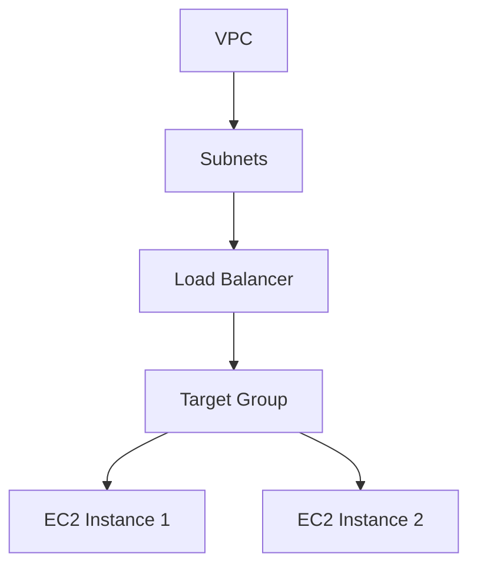

# demo mermaid test

```mermaid
flowchart TD
    VPC[VPC]
    Subnets[Subnets]
    LB[Load Balancer]
    TG[Target Group]
    EC2_1[EC2 Instance 1]
    EC2_2[EC2 Instance 2]

    VPC --> Subnets
    Subnets --> LB
    LB --> TG
    TG --> EC2_1
    TG --> EC2_2
```
